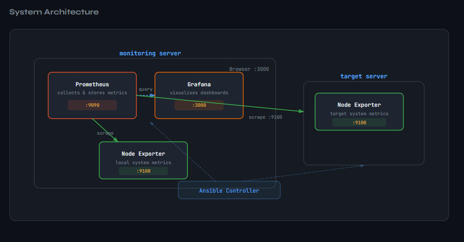
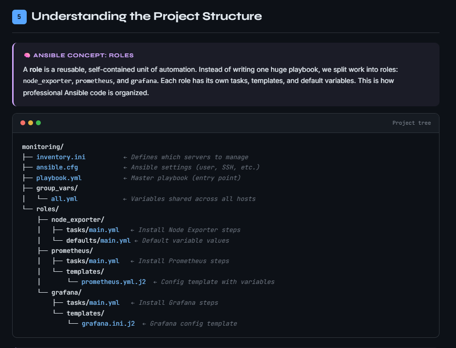

<div align="center">
  <h1>☁️ Build a Monitoring Stack with Ansible</h1>
  <p><strong>A fully automated deployment of Prometheus, Grafana, and Node Exporter on AWS EC2 using Ansible.</strong></p>
</div>

---


## 📋 Overview

This project provides an Ansible playbook to automatically configure and deploy a robust monitoring stack on Ubuntu 22.04 EC2 instances.

### Stack Components:
- **Prometheus**: Time-series database for metrics aggregation.
- **Grafana**: Beautiful dashboards for visualizing data.
- **Node Exporter**: Exposes hardware and OS metrics.

---

## 🚀 Prerequisites

1. **AWS Infrastructure**: Launch two Ubuntu 22.04 EC2 instances.
2. **SSH Access**: Create or reuse an EC2 Key Pair and save the `.pem` file locally (e.g., `~/keys/my-ec2-key.pem` or `~/keys/ansible.pem`).
3. **Control Node**: Ensure Ansible is installed on your local machine.

---


##  System Archietecture




## ⚙️ Setup & Configuration

1. **Inventory**: 
   Adjust `inventory.ini` with the public IPs of the instances and the path to your `.pem` file. You can verify SSH access via:
   ```bash
   ssh -i ~/keys/my-ec2-key.pem ubuntu@<INSTANCE_IP>
   ```

2. **VPC / Private IPs**: 
   If using private IPs in a VPC, set `target_server_ip` in `group_vars/all.yml` to the target's private IP.

3. **Security Groups**: 
   Ensure your AWS Security Groups allow traffic between instances and for external access on the following ports:
   - `9100` (Node Exporter)
   - `9090` (Prometheus)
   - `3000` (Grafana)

---

## 🛠️ Deployment

From the `monitoring` directory, you can run the playbook to deploy the stack. 

1. **Run a Dry-Run** (to check for potential errors):
   ```bash
   ansible-playbook playbook.yml --check -i inventory.ini
   ```

2. **Run for Real** (Deploy the stack):
   ```bash
   ansible-playbook playbook.yml -i inventory.ini
   ```

---


## Project Structure



## 🔍 Verification & Access

### Verify Services
You can verify the services are running directly via Ansible:
```bash
ansible monitoring_server -m command -a "systemctl is-active node_exporter prometheus grafana-server" -i inventory.ini
```

### Accessing the Applications

- **Prometheus Targets Check**: 
  Navigate to `http://<YOUR_IP>:9090/targets`
  
- **Grafana Dashboard**:
  - **URL**: `http://<YOUR_IP>:3000`
  - **Login**: `admin` / `admin123`
  - **Dashboard**: Once logged in, visit `/d/node-exporter-monitoring/node-exporter-system-monitoring` to view your system metrics.

---

## 💡 Important Notes

- **Provisioning Script**: The included provisioning script (`monitoring/scripts/provision_ec2.sh`) defaults to AWS region `us-east-2`. You can override this by setting the `AWS_DEFAULT_REGION` environment variable or by entering a different region when prompted.
